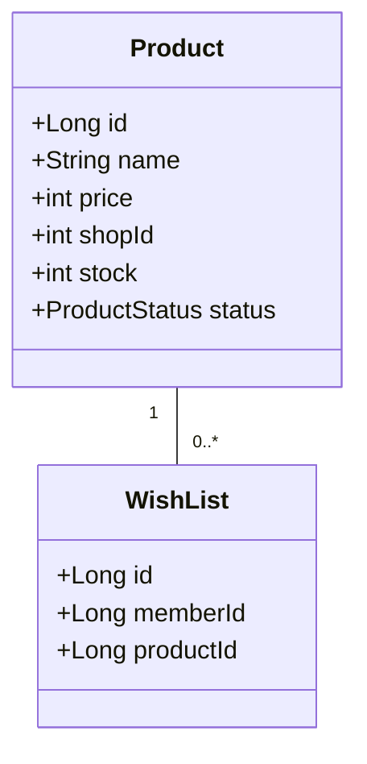
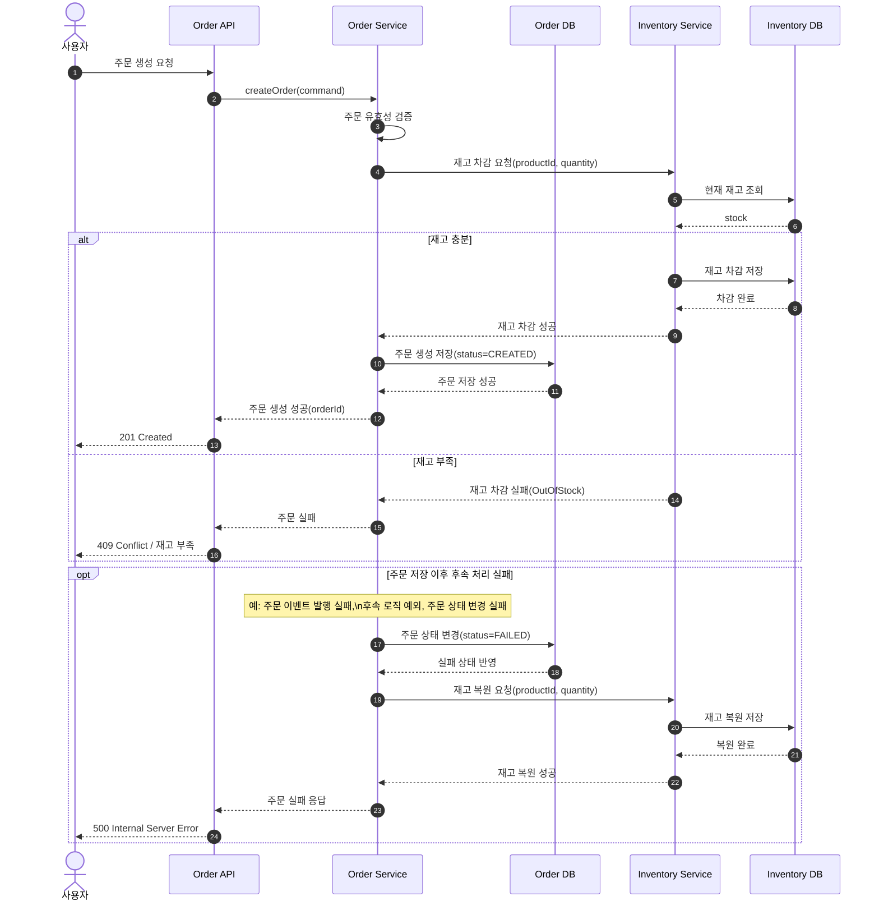

# 사용자 도메인과 상품 도메인, 주문 도메인을 별도 모듈로 분리하기

## 핵심 Use Case 정리

#### 상품 장바구니에 담기

1. 사용자가 상품을 장바구니에 담는다.
2. 시스템은 해당 상품이 활성 상태인지 확인한다.
3. 상품이 활성 상태이면, 장바구니에 상품과 수량을 추가
4. 상품이 비활성 상태이면, 오류 응답을 반환한다.
5. 장바구니에 담긴 상품의 재고는 차감되지 않는다.

#### 상품 찜하기

1. 사용자가 상품을 찜한다.
2. 시스템은 해당 상품이 활성 상태인지 확인한다.
3. 상품이 활성 상태이면, 찜 목록에 상품을 추가한다.
4. 상품이 비활성 상태이면, 오류 응답을 반환한다.
5. 찜한 상품의 재고는 차감되지 않는다.

#### 상품 주문하기

1. 사용자가 장바구니에 담긴 상품을 주문한다.
2. 시스템은 주문 요청을 검증한다.
3. 시스템은 주문 생성 시점에 재고를 선점한다.
    - 주문 생성이 성공하면, 주문 상세 페이지로 이동한다.
    - 주문 생성이 실패하면, 오류 응답을 반환한다.
4. 사용자는 배송 주소를 입력한다.
5. 사용자는 사용할 쿠폰을 선택한다.
6. 시스템은 해당 쿠폰의 유효성을 검증한다.
    - 쿠폰이 유효하면, 주문 금액에 쿠폰 할인을 적용한다.
    - 쿠폰이 유효하지 않으면, 오류 응답을 반환한다.
7. 사용자는 결제 수단을 선택한다.
8. 사용자는 결제를 완료한다.
9. 시스템은 결제 결과를 처리한다.
10. 결제 성공 시, 주문 상태를 `PAID`로 변경한다.
11. 결제 실패 시, 주문 상태를 `PAYMENT_FAILED`로 변경하고, 재고를 복원한다.

#### 상품 등록하기

1. 관리자가 상품 등록 버튼을 클릭한다.
2. 관리자는 상품 이름, 가격, 재고 수량, 상태를 입력한다.
3. 관리자는 상품의 쿠폰 적용 가능 여부를 선택한다.
4. 시스템은 입력된 정보를 검증한다.
5. 시스템은 상품을 생성한다.
6. 상품이 생성되면, 상품 상세 페이지로 이동한다.
7. 상품이 생성되지 않으면, 오류 응답을 반환한다.

#### 상품 수정하기

1. 관리자가 상품 수정 버튼을 클릭한다.
2. 관리자는 상품 이름, 가격, 재고 수량, 상태를 수정한다.
3. 관리자는 상품의 쿠폰 적용 가능 여부를 수정한다.
4. 시스템은 입력된 정보를 검증한다.
5. 시스템은 상품을 수정한다.
6. 상품이 수정되면, 상품 상세 페이지로 이동한다.
7. 상품이 수정되지 않으면, 오류 응답을 반환한다.

#### 상품 강제 품절 처리하기

1. 관리자가 상품 강제 품절 처리 버튼을 클릭한다.
2. 시스템은 해당 상품이 존재하는지 확인한다.
    - 상품이 존재하면, 상품 상태를 `INACTIVE`로 변경한다.
    - 상품이 존재하지 않으면, 오류 응답을 반환한다.
3. 시스템은 해당 상품이 결제되지 않은 주문에 포함되어 있는지 확인한다.
    - 상품이 결제되지 않은 주문에 포함되어 있으면, 해당 주문을 취소 처리한다.
    - 만약, 이미 결제된 주문에 포함되어 있다면, 해당 주문은 취소 처리하지 않는다.
    - 이때, 주문 취소 처리 시점에 재고를 복원한다.
4. 시스템은 해당 상품의 남은 재고 수량을 0으로 변경한다.
5. 상품이 강제 품절 처리되면, 상품 상세 페이지로 이동한다.

#### 상품 삭제하기

1. 관리자가 상품 삭제 버튼을 클릭한다.
2. 시스템은 해당 상품이 존재하는지 확인한다.
3. 시스템은 해당 상품이 주문에 포함되어 있는지 확인한다.
    - 상품이 존재하지 않으면, 오류 응답을 반환한다.
4. 시스템은 상품이 품절 상태인지 확인한다.
    - 상품이 품절 상태가 아니면, 오류 응답을 반환한다.
5. 시스템은 해당 상품을 삭제한다.
6. 상품이 삭제되면, 상품 목록 페이지로 이동한다.

## 현재 도메인 결정

- order - 주문 도메인
- product - 상품 도메인

### WishList는 어느 도메인에 있어야 하는가? - 사용자 vs 상품

- 사용자 관점에서 관심 있는 정보? 사용자가 직접 생성을 결정할 수 있음
- 하지만, 해당 상품의 정보는 상품 도메인에서 관리함.
- 사용자가 관리할 수 있는건 WishList 엔티티의 존재 여부 뿐
- 즉, 진짜 관심사는 찜한 "상품" 이다. 특정 사용자의 "찜 목록"이 아니다.
- 상품의 정보 전문가는 상품 도메인이다. 상품 도메인에서 찜한 상품의 목록을 조회할 수 있어야 한다.

### cart 도메인은 어느 도메인에 있어야 하는가? - 상품 vs 주문 vs 사용자

- 상품 도메인은 재고를 관리한다.
- 주문 도메인은 주문을 관리한다.
- 사용자 관점에서 관심 있는 정보? 사용자가 직접 생성을 결정할 수 있음
- 하지만, 해당 상품의 정보는 상품 도메인에서 관리함.
- 상품 도메인이 진짜 관심 있는건 "재고" 이다. 특정 사용자의 "장바구니"가 아니다.

#### 주문 도메인에 있을 때

- 장점
    - 사용자가 가지고 있는 장바구니는 주문과 밀접한 관련이 있다. 주문 도메인에서 장바구니를 관리하면, 주문 생성 시점에 재고 차감 요청을 바로 처리할 수 있다. (재고 선점)
- 단점
    - 재고 차감 요청이 주문 생성 시점에 발생하므로, 상품 도메인과 주문 도메인 간의 통신이 필요하다. (재고 선점)

#### 상품 도메인에 있을 때

- 장점
    - 재고 차감 요청이 상품 도메인에 있으므로, 주문 생성 시점에 재고 차감 요청을 바로 처리할 수 있다. (재고 선점)
- 단점
    - 재고 차감 요청이 상품 도메인에 있더라도, 상품 도메인이 주문 생성 요청을 수행해야 한다.(주문 처리)
    - 즉, 순서에 관계 없이 상품 도메인과 주문 도메인 간의 통신이 필요하다.
    - 이때, 주문 도메인은 상품 도메인의 하위 트랜잭션이 되는 형태가 된다. (상품 - 주문 - 결제)
    - 트랜잭션 계층 관계가 깊어질수록, 코드는 읽기 어려워지고, 트랜잭션이 길어지기에 성능이 나빠지며, 유지보수 비용이 증가한다.
    - 서비스 오케스트레이션 or MQ 이벤트 교환으로 계층 관계를 느슨하게 만들어야 한다.

cart의 핵심 관심사는 상품 자체가 아니라, "사용자의 임시 구매 의도"이다.

- 수량 변경
- 선택/해제
- 비우기
  따라서, cart 도메인은 주문 도메인에 위치하는 것이 더 적절하다.

## 재고 차감

### 재고 차감 시점에 대한 고민

- 주문 생성 시점에 재고를 차감한다. (재고 선점)
- 주문 결제 시점에 재고를 차감한다. (재고 후점)
- 재고 선점은 재고 부족으로 인한 주문 실패를 줄일 수 있지만, 주문 취소 시 재고 복원이 필요하다.
- 재고 후점은 주문 취소 시 재고 복원이 필요 없지만, 재고 부족으로 인한 주문 실패가 발생할 수 있다.
- UX 측면에서는 어떤 방식이 더 나은가?
    - 사용자는 "돈"과 관련된 행동에 대해서는 더 예민하다.
    - 결제는 자신의 "돈"과 직접적으로 연결된 행동이다.
    - 결제 시점에 재고 부족으로 인한 주문 실패가 발생하면, 사용자는 "돈"이 빠져나갔다고 생각할 수 있다.
- 장바구니에서 주문을 생성할 때, 재고를 선점하는 방식으로 구현한다. 주문 생성 시점에 재고를 차감한다. 주문 취소 시 재고를 복원한다.

### 재고 차감/복원 방식에 대한 고민

재고 차감과 주문 처리 간의 관계에만 집중해서 시퀀스 다이어그램을 그려보자.

여기서, 특히 Order DB와 Inventory DB 간에는 DB 트랜잭션으로 묶일 수 없다는 점에 주목하자.
(분산 트랜잭션은 사용하지 않기로 결정했으므로) 따라서, 재고 차감과 주문 생성이 하나의 트랜잭션으로 묶일 수 없다.

따라서, 이때 상대 DB에 보낼 이벤트는 아웃박스에 기록해서 커밋해야 하는데,

- 상대방한테 알리는 이벤트는 커밋하고,
- 내 비즈니스 로직은 예외를 던져 롤백한다

는 형태가 좀 비직관적이긴 하다.

#### DB 트랜잭션을 아예 안쓰고, 상태 기계로 주문의 상태를 완전히 관리하는 형태로 구현?

DB 트랜잭션을 최소화하고 항상 어느 WAS에서 진행하든, 이벤트 발행과 비즈니스 로직이 원자적으로 처리되는 형태로 구현하는 방법도 생각해볼 수 있다.
**비즈니스 로직은 항상 커밋하되, 상태 기계로 주문의 상태를 완전히 관리하는 형태로 구현하면**, 좀 더 안정적인 재고 차감과 주문 생성 간의 관계를 표현할 수 있을 것 같다.

> 완전한 이중화 및 주문 ID idempotency, 되감기 없는 **단방향 상태 전이**로 구현할 수 있다면,
> 로그 형태로 결제 상태 변경을 기록하여, 결제 상태 변경의 Consistency, Durability를 강하게 보장하는 형태로 구현하는 방법도 생각해볼 수 있다.

지금은 이 방식을 안쓰더라도 **결제 모듈의 경우**에는 반드시 이 방식을 적용해서,
외부 API 호출과 결제 상태 관리/이벤트 기록 간의 원자성을 강하게 보장해야 겠다는 생각이 든다.

우선 이 방식은 최후의 수단으로 생각하고, 구현의 편의성을 위해, Order DB 트랜잭션과 Inventory DB 트랜잭션을 원자적으로 만들어, 재고 복원과 주문 취소가 하나의 트랜잭션으로 묶이는 형태로 구현하는
것을 우선적으로 고려해보자.

### 재고 차감/복원 방식에 대한 구현 방식 비교

- 이벤트 기반 재고 차감(코레오그래피): 주문 생성 시점에 상품 도메인으로 주문 생성 이벤트를 발행한다. 주문 취소 시점에 주문 취소 이벤트를 발행한다.
    - 항상 성공을 보장해야 한다.
  - 상품 도메인은 주문 생성 이벤트를 구독하여 재고 차감을 수행한다. 주문 취소 이벤트를 구독하여 재고 복원을 수행한다.
  - 재고 차감이 실패하면, 주문 생성이 실패해야 한다.
  - 재고 복원이 실패하면, 성공 시 까지 지수적 백오프를 통해 재고 복원을 재시도 해야 한다.
  - 재고 차감 처리와 재고 복원 처리는 idempotent 해야 한다. (중복 이벤트 처리 방지)
  - 주문 처리 실패 발생 시, 이벤트를 기록(아웃박스)하고 주문 취소로 저장한다. (즉, 롤백하지 않는다.)
- 서비스 기반 재고 차감(오케스트레이션): 주문 생성 시점에 상품 도메인으로 재고 차감 요청을 보낸다. 주문 취소 시점에 상품 도메인으로 재고 복원 요청을 보낸다.
    - 주문 생성 시점에 재고 차감 요청이 실패하면, 주문 생성이 실패해야 한다.
    - 주문 취소 시점에 재고 복원 요청이 실패하면, 성공 시 까지 지수적 백오프를 통해 재고 복원을 재시도 해야 한다.

복잡한 이벤트 교환 메커니즘이 필요하진 않으니, 코레오그래피로 구현을 마무리지었다.

---

# 주문, 상품, 사용자 도메인 분리 체크리스트

## 도메인 분류

- 상품 도메인
    - Wishlist
    - Product
- 주문 도메인
    - Cart
    - Order
- 사용자 도메인
    - User
    - Address
